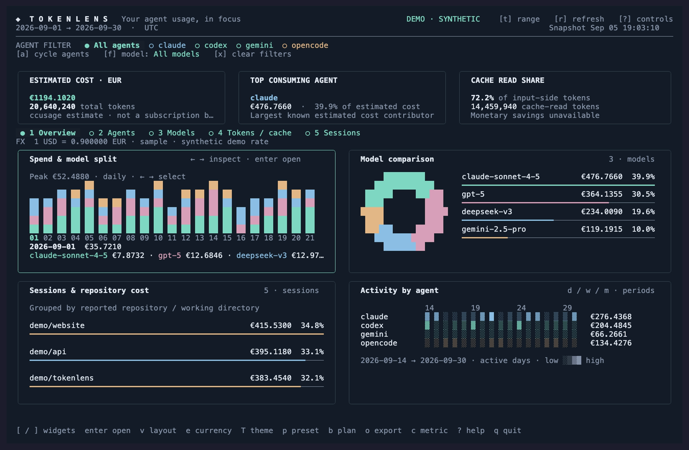

# Tokenlens

Your coding-agent usage, in focus. A native Go dashboard built with Bubble Tea, Lip Gloss, and Charm components, powered by structured ccusage JSON.



## Start

Requires **Go 1.25+**, and either **Bun** or a compatible **ccusage** executable on PATH.

```sh
go run . --currency EUR
```

Run this from the project directory. Use **`go run .`**, not `go run main.go`: the application spans multiple Go files.

Tokenlens prefers an installed `ccusage`. Otherwise it automatically runs **`bunx --bun ccusage@20.0.20`**. Bun downloads the pinned backend into its shared local cache on first use; you do **not** need `npm install -g ccusage`. That first download needs network access and can take longer. The CLI and actual JSON shape were verified with ccusage 20.0.20, and automatic launch was verified with Bun 1.3.5. See [Bun installation](https://bun.sh/docs/installation) if `bunx` is unavailable.

To preview without Bun, ccusage, or usage logs:

```sh
go run . --demo --currency EUR
```

Demo data and its exchange rate are synthetic and visibly labeled. For a binary you can run without recompiling:

```sh
go build -o bin/tokenlens .
./bin/tokenlens --currency EUR
```

Other examples:

```sh
go run . weekly --last 8 --currency EUR --timezone Europe/Dublin
go run . monthly --since 20260101 --currency GBP
go run . --since 20260901 --until 2026-09-30
go run . --ccusage /path/to/ccusage
go run . --theme light
go run . --currency EUR --plan-cost 100 --plan-agent claude --billing-day 15
```

## Dashboard

Wide terminals show summary cards and a two-column widget grid, expanding to use the window. Smaller terminals use a compact ranked view. Minimum size is **50×16**; **150×45** or larger gives the charts room.

- **Spend & model split:** stacked bars grouped by day, week, or month; model colors stay consistent. Arrow keys or mouse motion select a period, and Enter opens its exact values.
- **Model comparison:** proportional ring and ranked bars with exact estimated costs or token counts.
- **Sessions & repository cost:** session rankings; repository grouping is used only when every selected session has explicit repository/working-directory metadata. Otherwise the widget states that repository attribution is unavailable.
- **Activity by agent:** per-agent daily activity, scoped to the displayed date window. This is daily usage, not a claim about coding hours.
- **Tokens / cache:** input, output, cache read/write, proportional cache ring, and a cache-read progress bar.

All available agent and model names are discovered dynamically. Agent and model filters are independent. Exact numbers and percentages accompany the charts. Missing metrics display **unavailable**; incomplete sums display **`+ ?`**, with misleading percentages suppressed.

## Controls

| Key | Action |
| --- | --- |
| `1`–`5`, `tab` / `shift+tab` | Overview, agents, models, tokens/cache, sessions |
| `d` / `w` / `m` | Daily / weekly / monthly grouping |
| `←` / `→`, mouse over stacked chart | Inspect a period |
| `[` / `]`, `enter` | Focus / open overview widget |
| `v` | Switch grid layout |
| `↑` / `↓`, `j` / `k`, `home` / `end` | Navigate ranked rows |
| `a` / `f`, `x` | Cycle agent / model filter; clear filters |
| `n` | Toggle compact k/M/B token labels (inspector remains exact) |
| `c` / `s` | Cost vs. tokens; descending / ascending / name sorting |
| `e` | Cycle USD, EUR, GBP, JPY |
| `T` | Dark, light, terminal ASCII theme |
| `t` | Edit dates: two dates, `month`, or `last N` |
| `p` | Calendar month → billing cycle → last 30 days → since August 1 |
| `b` | Toggle configured subscription-plan comparison |
| `o`, then `1`–`4` | Export JSON / CSV / SVG / PNG |
| `r` | Refresh usage and exchange rate |
| `h` | Explain unavailable hourly / 5-hour data |
| `?`, `esc` | Help; close editor, details, or error |
| `q` / `ctrl+c` | Quit |

Settings are per run. To keep a default display currency, add `export TOKENLENS_CURRENCY=EUR` to your shell configuration. `--currency` overrides it.

## Dates and billing

Dates accept valid **YYYYMMDD** or **YYYY-MM-DD**, inclusive. With no range flags, the range is the current calendar month. A single explicit bound remains open on the other side. `--last N` includes the current day/week/month, ends today, and cannot combine with date bounds. Weeks begin Monday.

Grouping changes preserve the range. The timezone defaults to UTC, or `TZ` when set; `--timezone` controls both backend filtering and calendar resolution. IANA timezone data is embedded.

The billing preset uses `--billing-day` (default 1), clamped for shorter months, through today. “Since August 1” uses the most recent August 1. `--plan-cost` is your manually configured monthly plan amount in the startup currency; use `--plan-agent` to scope it to the covered agent. Press `b` to compare selected-range API-equivalent usage with that amount. This is **not money saved, subscription credit, an invoice, or proof that every recorded call was included in the plan**. Choose a matching billing range and filter for a meaningful comparison. Changing currency temporarily disables comparison until the configured plan currency is selected again.

## Currency

Non-USD displays fetch the latest published **ECB reference rate via [Frankfurter](https://frankfurter.dev/)** asynchronously. The rate, date, and source stay visible. Only the currency pair is sent; usage data remains local.

These are daily reference rates, **not real-time market quotes**. A single latest rate converts all displayed costs, including historical reports. It is not a historical transaction conversion or a bank's exchange rate. Weekends/holidays can produce an earlier source date. Unsupported currencies or a failed first request leave amounts explicitly labeled USD. A failed later refresh keeps the previous rate with its date and a warning. Demo mode uses a clearly labeled synthetic rate of 0.9 for non-USD currencies and makes no rate request.

All internal costs remain USD. Currency switching changes presentation, not token counts or percentages.

## Startup and caching

There are two independent caches:

1. **Bun's package cache** stores ccusage after its first download.
2. **Tokenlens snapshots** store the last report for each range, timezone, backend, and pricing mode in the OS user cache directory under `tokenlens`.

A matching snapshot appears immediately while a fresh report loads asynchronously. Its cached status and timestamp are visible. Snapshots older than seven days are not used. Files are private (0600 on Unix), written atomically, and contain usage details; don't publish your cache directory. Use `--no-cache` to disable snapshot reads/writes or `--cache-dir` to select a directory. Demo mode never persists snapshots. Cached files are not automatically deleted when they expire; you can remove Tokenlens's cache directory to clear them.

Normal ccusage pricing refreshes can still take tens of seconds even with the package installed. **`--offline`** uses ccusage's cached-pricing mode and can be much faster:

```sh
go run . --currency EUR --offline
```

It is explicitly labeled because estimates **may differ materially** from online pricing; Tokenlens never enables it silently. This flag affects ccusage, not the separate exchange-rate request. Snapshot and exchange-rate refreshes run independently. Superseded loads are canceled, backend loads time out after two minutes, and macOS/Linux cancellation also terminates Bun's installer children.

## Data limits

The adapter uses released unified JSON: `period`, `agents`, and `modelBreakdowns`. It calls:

```sh
ccusage daily --sections daily,weekly,monthly,session --by-agent --json \
  --timezone UTC --since 2026-09-01 --until 2026-09-30
```

- Token counts alone do not establish **cache money saved**. The necessary uncached per-model prices are not in this report, so savings remain unavailable.
- Unified sessions tested in 20.0.20 did **not** include repository attribution or timestamped cost events. Tokenlens does not treat a session start time as the timestamp of all its spending, or infer a repository from a session ID.
- **Hourly and five-hour blocks are different groupings**, and neither can be reconstructed accurately from daily totals. Daily/weekly/monthly are available; the UI explains the unsupported granularities.
- Source-level reported zero remains zero. Tokenlens cannot tell when an upstream source substitutes zero for missing data.
- Model token totals are derived only when all four normalized input/output/cache categories exist. Session attribution follows ccusage's semantics.

There is no local log parser, telemetry, background synchronization, or Tokenlens npm launcher. The optional automatic backend invocation through Bun is separate from packaging Tokenlens itself.

## Exports

Press `o`, then choose JSON, CSV, SVG, or PNG. Files go into `./exports` (or `--export-dir`) and are never overwritten. JSON/CSV contain all filtered rows, underlying USD estimates, display currency/rate metadata, and the selected range. SVG/PNG are standalone ranked charts of up to 30 rows. Image charts are not full-terminal screenshots. CSV labels are escaped to remain text in spreadsheets. Exported usage can contain private names; the default export directory is gitignored.

## Development

```sh
go test ./...
go test -race ./...
go vet ./...
go build -o bin/tokenlens .
```

Tests cover dates/DST, billing boundaries, dynamic filters, missing metrics, cache identity/privacy/expiry, backend selection, exchange-rate errors, ANSI layouts/themes, period inspection, and all export formats. Optional integration checks: `TOKENLENS_TEST_LIVE_FX=1 go test -run TestLiveExchangeOptIn -v` and `TOKENLENS_TEST_SNAPSHOT=/path/to/report.json go test -run TestRealSnapshotOptIn -v`. Keep private report files outside the repository.

See [ccusage options](https://ccusage.com/guide/cli-options), [JSON examples](https://ccusage.com/guide/json-output), and [Bun executable caching](https://bun.sh/docs/pm/bunx).

## License

MIT. ccusage and Charm dependencies retain their respective licenses.
