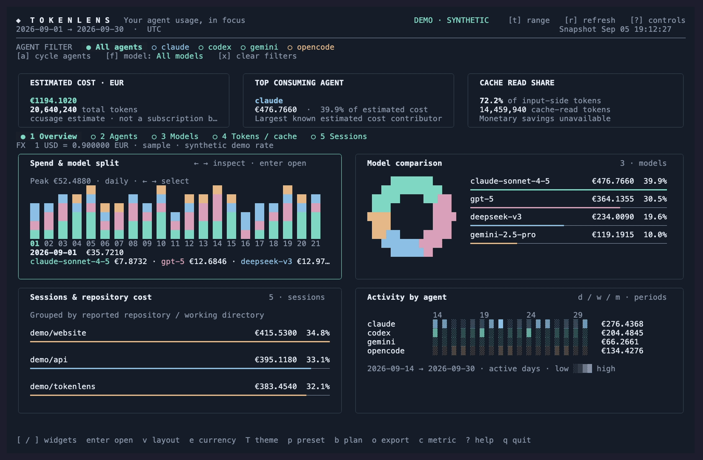

# Tokenlens

<p align="center">
  
</p>

[](https://github.com/Kameleon21/tokenlens/releases/latest)
[](https://github.com/Kameleon21/tokenlens/stargazers)
[](https://github.com/Kameleon21/tokenlens/graphs/contributors)

See your coding-agent token usage and estimated costs in your terminal. Compare agents and models, explore dates, and export reports.



*The demo uses made-up data. [Watch the MP4](docs/assets/demo.mp4).*

## Install and run

Download a prebuilt archive for your OS and architecture from
[GitHub Releases](https://github.com/Kameleon21/tokenlens/releases), verify its
SHA-256 checksum, and extract the **whole archive**. Keep the `libexec` directory
beside `tokenlens` (`tokenlens.exe` on Windows), and add the extracted directory
to your `PATH`. Release bundles include native ccusage; Bun is not required.

On macOS/Linux, the archive's updater installs the complete release and verifies
its checksum. Run it again whenever you want the latest published release:

```sh
python3 scripts/install_release.py
```

Its default executable location is `~/.local/bin/tokenlens`; keep that directory
on your `PATH`. Use `--bin-dir "$HOME/go/bin"` to replace a previous Go installation.
See the [release guide](docs/releases.md#installing-and-updating) for details.

Alternatively, install from source with **Go 1.25+** and either
[Bun](https://bun.sh) or **ccusage 20.0.20**:

```sh
go install github.com/Kameleon21/tokenlens@latest
tokenlens
```

Make sure Go's binary directory (usually `~/go/bin`) is on your `PATH`.
From a local checkout, use `go install .` or `go run .`.
Run `tokenlens --version` to check your version. See the [changelog](CHANGELOG.md)
and [release guide](docs/releases.md) for version history and release conventions.
Tokenlens checks for its bundled backend first, then installed ccusage, then Bun.
`go install` does not install the companion backend. `--ccusage /path/to/backend`
explicitly selects another backend and keeps its own pricing behavior.

Try it without any usage logs or backend:

```sh
tokenlens --demo
```

## Everyday use

```sh
tokenlens --currency EUR
tokenlens weekly --last 8
tokenlens --since 2026-08-01 --until 2026-08-31
tokenlens --theme nord  # Ctrl+T opens the theme picker
```

The default date range is this calendar month. Dates are inclusive. Tokenlens uses your system timezone by default. `TZ` overrides it, and `--timezone` takes priority over both.
Currency, applied theme, grouping, and display choices are remembered automatically.
On macOS and Linux they live in `~/.config/tokenlens/config.toml` (or
`$XDG_CONFIG_HOME/tokenlens/config.toml`). Run `tokenlens config path` to locate
the file or `tokenlens config reset` to reset preferences.
See [saved preferences](docs/usage.md#saved-preferences) for all settings and Windows paths.
`TOKENLENS_CURRENCY` and explicit CLI flags override saved defaults for that launch.

| Key | What it does |
| --- | --- |
| `1`–`5` / `tab` | Switch views |
| `d` / `w` / `m` | Group by day, week, or month |
| `a` / `f` / `x` | Filter agent, filter model, clear filters |
| `t` / `p` | Enter dates / cycle date presets |
| `c` / `e` | Switch cost/token view / currency |
| `r` | Fetch a fresh report |
| `o` | Export JSON, CSV, SVG, or PNG |
| `Ctrl+T` | Search and preview themes |
| `?` / `q` | All controls / quit |

## Loading speed

Recent reports are reused for **five minutes**, so reopening Tokenlens or returning to the same dates can skip ccusage. Older saved reports stay visible while updated data loads. The report timestamp and cached label show what you are viewing.

- Press `r` to fetch new usage immediately. Pressing it again during the same load keeps that request running.
- Currency, grouping, and filter changes do not rerun the usage report.
- Use `--cache-ttl 30s` for a shorter reuse window, or `--cache-ttl 0` to always reload.
- Model prices come from a bundled or downloaded LiteLLM catalog. Older prices refresh in the background, without delaying the first report. The price date and incomplete coverage are shown.
- Use `--offline` to disable background price downloads. Currency conversion still needs an exchange-rate request.
- `--no-cache` disables report and price-cache reads/writes. Saved reports live in your OS user cache under `tokenlens`; `--cache-dir` changes that location.

First loads and dates without a saved report still scan logs through ccusage. See the [performance plan](docs/performance.md) for how Tokenlens could eventually read usage logs itself.

## What the numbers mean

Costs are estimates from ccusage, not your subscription bill. Currency conversion uses the latest published ECB reference rate via Frankfurter, including for historical usage. Missing values are shown as unavailable.

Usage reports stay local. Background pricing downloads fetch the public LiteLLM catalog; no usage logs are sent. Non-USD conversion sends only the currency request. Cached reports and exports can contain private project or session names. Demo mode uses synthetic data and makes no backend or exchange-rate requests.

See the [usage reference](docs/usage.md) for billing comparisons, exports, cache details, and data limits. Run `tokenlens --help` for all flags.

## Contributing

Read [CONTRIBUTING.md](CONTRIBUTING.md) for setup, checks, and pull request guidelines. Small fixes and documentation improvements are welcome.

## License

[MIT](LICENSE).

Powered by [ccusage](https://github.com/ccusage/ccusage), created by [ryoppippi](https://github.com/ryoppippi) and distributed under the [MIT license](third_party/ccusage-LICENSE).
