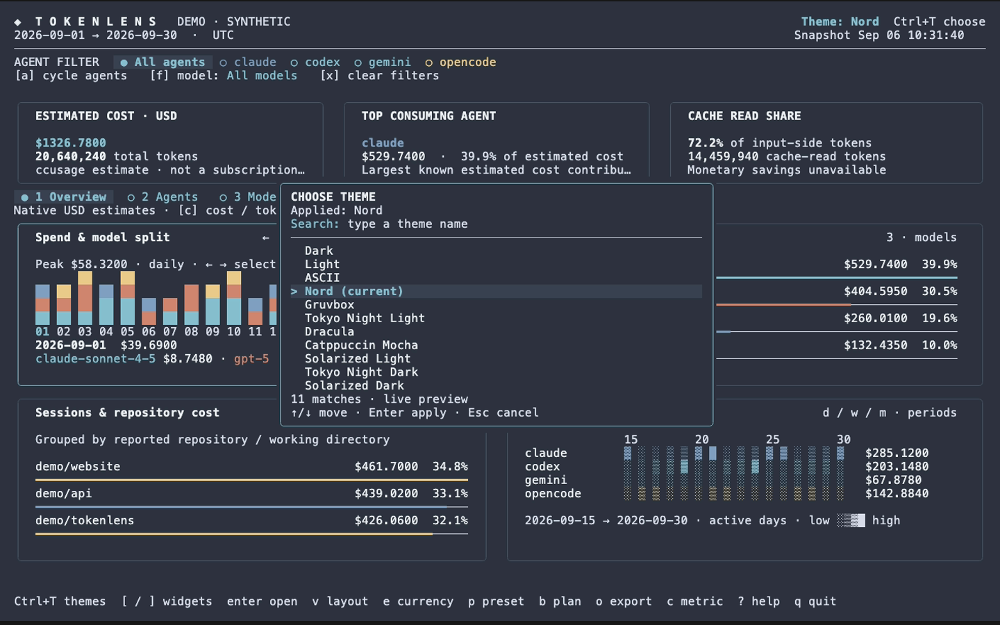
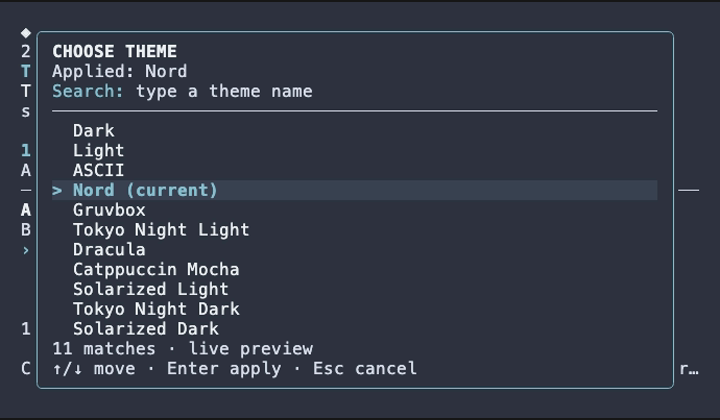

# Usage reference

## Dashboard

Wide terminals show summary cards and a two-column widget grid, expanding to use the window. Smaller terminals use a compact ranked view. Minimum size is **50×16**; **150×45** or larger gives the charts room.

- **Spend & model split:** stacked bars grouped by day, week, or month; model colors stay consistent. Arrow keys or mouse motion select a period, and Enter opens its exact values.
- **Model comparison:** proportional ring and ranked bars with exact estimated costs or token counts.
- **Sessions & repository cost:** session rankings; repository grouping is used only when every selected session has explicit repository/working-directory metadata. Otherwise the widget states that repository attribution is unavailable.
- **Activity by agent:** per-agent daily activity, scoped to the displayed date window. This is daily usage, not a claim about coding hours.
- **Tokens / cache:** input, output, cache read/write, proportional cache ring, and a cache-read progress bar.

All available agent and model names are discovered dynamically. Agent and model filters are independent. Exact numbers and percentages accompany the charts. Missing metrics display **unavailable**; incomplete sums display **`+ ?`**, with misleading percentages suppressed.

## Controls

| Key | Action |
| --- | --- |
| `1`–`5`, `tab` / `shift+tab` | Overview, agents, models, tokens/cache, sessions |
| `d` / `w` / `m` | Daily / weekly / monthly grouping |
| `←` / `→`, mouse over stacked chart | Inspect a period |
| `[` / `]`, `enter` | Focus / open overview widget |
| `v` | Switch grid layout |
| `↑` / `↓`, `j` / `k`, `home` / `end` | Navigate ranked rows |
| `a` / `f`, `x` | Cycle agent / model filter; clear filters |
| `n` | Toggle compact k/M/B token labels (inspector remains exact) |
| `c` / `s` | Cost vs. tokens; descending / ascending / name sorting |
| `e` | Cycle USD, EUR, GBP, JPY |
| `Ctrl+T` | Open searchable theme popup (Shift+T also opens it) |
| `t` | Edit dates: two dates, `month`, or `last N` |
| `p` | Calendar month → billing cycle → last 30 days → since August 1 |
| `b` | Toggle configured subscription-plan comparison |
| `o`, then `1`–`4` | Export JSON / CSV / SVG / PNG |
| `r` | Refresh usage and exchange rate |
| `h` | Explain unavailable hourly / 5-hour data |
| `?`, `esc` | Help; close editor, details, or error |
| `q` / `ctrl+c` | Quit |

Settings are per run. To keep a default display currency, add `export TOKENLENS_CURRENCY=EUR` to your shell configuration. `--currency` overrides it.

## Dates and billing

Dates accept valid **YYYYMMDD** or **YYYY-MM-DD**, inclusive. With no range flags, the range is the current calendar month. A single explicit bound remains open on the other side. `--last N` includes the current day/week/month, ends today, and cannot combine with date bounds. Weeks begin Monday.

Grouping changes preserve the range. The timezone defaults to your system timezone (for example, `Europe/Dublin`).
`TZ` overrides the system default, and `--timezone` overrides both. The same
IANA timezone controls calendar ranges, billing presets, backend filtering and
grouping, and snapshot cache separation, including daylight-saving transitions.
The selected timezone is shown beside the date range. IANA timezone data is embedded.

On macOS/Linux, Tokenlens reads the system timezone configuration. Where the
IANA name is not available there (including Windows), it asks the installed
Node.js or Bun runtime for the system timezone, without network access. If it
cannot resolve a name, set `--timezone Europe/Dublin` or another IANA timezone.

The billing preset uses `--billing-day` (default 1), clamped for shorter months, through today. “Since August 1” uses the most recent August 1. `--plan-cost` is your manually configured monthly plan amount in the startup currency; use `--plan-agent` to scope it to the covered agent. Press `b` to compare selected-range API-equivalent usage with that amount. This is **not money saved, subscription credit, an invoice, or proof that every recorded call was included in the plan**. Choose a matching billing range and filter for a meaningful comparison. Changing currency temporarily disables comparison until the configured plan currency is selected again.

## Currency

Non-USD displays fetch the latest published **ECB reference rate via [Frankfurter](https://frankfurter.dev/)** asynchronously. The rate, date, and source stay visible. Only the currency pair is sent; usage data remains local.

These are daily reference rates, **not real-time market quotes**. A single latest rate converts all displayed costs, including historical reports. It is not a historical transaction conversion or a bank's exchange rate. Weekends/holidays can produce an earlier source date. Unsupported currencies or a failed first request leave amounts explicitly labeled USD. A failed later refresh keeps the previous rate with its date and a warning. Demo mode uses a clearly labeled synthetic rate of 0.9 for non-USD currencies and makes no rate request.

All internal costs remain USD. Currency switching changes presentation, not token counts or percentages.

## Startup and caching

There are two independent caches:

1. **Bun's package cache** stores ccusage after its first download.
2. **Tokenlens snapshots** store the last report for each range, timezone, backend, and pricing mode in the OS user cache directory under `tokenlens`.

A matching snapshot younger than `--cache-ttl` (default five minutes) is reused without launching ccusage. Older matching snapshots appear while a fresh report loads. Press `r` to force a fresh report; repeated presses while the same range is loading do not restart it. Up to 16 visited ranges are also kept in memory. Set `--cache-ttl 0` to always reload. A new range still needs ccusage. Its cached status and timestamp are visible. Snapshots older than seven days are not used. Files are private (0600 on Unix), written atomically, and contain usage details; don't publish your cache directory. Use `--no-cache` to disable snapshot reads/writes or `--cache-dir` to select a directory. Demo mode never persists snapshots. Cached files are not automatically deleted when they expire; you can remove Tokenlens's cache directory to clear them.

Normal ccusage pricing refreshes can still take tens of seconds even with the package installed. **`--offline`** uses ccusage's cached-pricing mode and can be much faster:

```sh
go run . --currency EUR --offline
```

It is explicitly labeled because estimates **may differ materially** from online pricing; Tokenlens never enables it silently. This flag affects ccusage, not the separate exchange-rate request. Snapshot and exchange-rate refreshes run independently. Switching currency only fetches an exchange rate. Superseded loads are canceled, backend loads time out after two minutes, and macOS/Linux cancellation also terminates Bun's installer children.

## Data limits

The adapter uses released unified JSON: `period`, `agents`, and `modelBreakdowns`. It calls:

```sh
ccusage daily --sections daily,weekly,monthly,session --by-agent --json \
  --timezone UTC --since 2026-09-01 --until 2026-09-30
```

- Token counts alone do not establish **cache money saved**. The necessary uncached per-model prices are not in this report, so savings remain unavailable.
- Unified sessions tested in 20.0.20 did **not** include repository attribution or timestamped cost events. Tokenlens does not treat a session start time as the timestamp of all its spending, or infer a repository from a session ID.
- **Hourly and five-hour blocks are different groupings**, and neither can be reconstructed accurately from daily totals. Daily/weekly/monthly are available; the UI explains the unsupported granularities.
- Source-level reported zero remains zero. Tokenlens cannot tell when an upstream source substitutes zero for missing data.
- Model token totals are derived only when all four normalized input/output/cache categories exist. Session attribution follows ccusage's semantics.

There is no local log parser, telemetry, background synchronization, or Tokenlens npm launcher. The optional automatic backend invocation through Bun is separate from packaging Tokenlens itself.

## Exports

Press `o`, then choose JSON, CSV, SVG, or PNG. Files go into `./exports` (or `--export-dir`) and are never overwritten. JSON/CSV contain all filtered rows, underlying USD estimates, display currency/rate metadata, and the selected range. SVG/PNG are standalone ranked charts of up to 30 rows. Image charts are not full-terminal screenshots. CSV labels are escaped to remain text in spreadsheets. Exported usage can contain private names; the default export directory is gitignored.

### Themes

Press `Ctrl+T` to open the centered theme picker. Type a name or a fuzzy query
such as `tnd` for Tokyo Night Dark. Use Up/Down, Ctrl+N/Ctrl+P, or Tab/Shift+Tab
to preview matches live on the dashboard. Enter applies the selection; Escape
restores the theme you had before opening the popup. Shift+T remains an alias
for opening the picker. While searching, letter keys enter text rather than
triggering dashboard shortcuts.

Choose from Dark, Light, ASCII, Nord, Gruvbox, Tokyo Night Light, Tokyo Night
Dark, Dracula, Catppuccin Mocha, Solarized Light, and Solarized Dark. The applied
theme is marked in the list, and the current preview's name appears in the
header. The popup scrolls to fit compact terminals.

The selection lasts for the current run. Choose a startup theme with `--theme`:

```sh
tokenlens --theme nord
tokenlens --theme gruvbox
tokenlens --theme tokyo-light
tokenlens --theme dracula
tokenlens --theme catppuccin
tokenlens --theme solarized-light
tokenlens --theme tokyo-dark
tokenlens --theme solarized-dark
```

Existing `dark` (default), `light`, and `ascii` values remain available.
Palettes are adapted for terminal dashboards from [Nord](https://www.nordtheme.com/docs/colors-and-palettes),
[Gruvbox](https://github.com/morhetz/gruvbox), [Tokyo Night](https://github.com/folke/tokyonight.nvim),
[Dracula](https://draculatheme.com/contribute), [Catppuccin](https://catppuccin.com/palette/),
and [Solarized](https://ethanschoonover.com/solarized/).




## Saved preferences

Tokenlens remembers choices you apply inside the TUI: currency (`e`), theme
(Ctrl+T then Enter), grouping (`d`/`w`/`m`), cost/token display (`c`), compact
numbers (`n`), and overview layout (`v`). Theme previews and Escape do not save.
These preferences also apply to demo mode. Dates, filters, searches, and the
current view remain session-only.

On **macOS and Linux**, preferences live in
`~/.config/tokenlens/config.toml`. An absolute `$XDG_CONFIG_HOME` overrides
`~/.config`; a relative value is ignored. On **Windows**, the file lives at
`%AppData%\tokenlens\config.toml`.

```sh
tokenlens config path   # print the exact location; does not create a file
tokenlens config reset  # remove saved preferences; leave usage caches intact
```

The file is created on the first TUI preference change, not simply on startup.
You can also create or edit it yourself:

```toml
currency = "EUR"
theme = "tokyo-dark"
grouping = "daily"
display = "cost"
compact_numbers = false
layout = "dashboard"
```

Missing fields use defaults. Grouping accepts `daily`, `weekly`, or `monthly`;
display accepts `cost` or `tokens`; layout accepts `dashboard` or `stacked`.
Use the theme identifiers shown by `tokenlens --help`.

An explicit CLI option takes precedence over an environment variable, then the
saved preference, then the default. For example, `--currency USD` overrides
`TOKENLENS_CURRENCY=GBP`, which overrides a saved EUR preference. Positional
`daily`, `weekly`, or `monthly` overrides saved grouping. One-off CLI or
environment overrides never update the file. Changing a preference inside the
TUI saves only that choice, so changing layout won't save an unrelated CLI
currency override. Timezone continues to follow the system, `TZ`, or `--timezone`.

The file is rewritten as TOML when saving, so formatting and comments are not
preserved. Invalid values or unknown keys produce an error with the file path;
edit the file or use `tokenlens config reset` to recover. `--help`, `--version`,
and config commands remain available even with invalid preferences. A failed
save shows a notice and leaves the current TUI choice usable for that session.
Reset affects future launches; an already open TUI can save new choices again.
